# ⚡ Lightning-Fusion: Bitcoin ↔ Ethereum Cross-Chain Swaps

> **Extending 1inch Fusion+ Protocol to Support Bitcoin via Lightning Network**

A hackathon prototype that enables trustless, atomic swaps between Bitcoin and Ethereum using the Lightning Network as a bridge, built on top of 1inch's proven Fusion+ protocol architecture.

## 🌟 Public Benefit & Use Case

### The Problem
The cryptocurrency ecosystem is fragmented across multiple blockchains, with Bitcoin and Ethereum representing the two largest networks by market capitalization. Users face significant challenges when trying to move value between these networks:

- **Centralized Bridges**: Most existing solutions require trusting centralized intermediaries, introducing counterparty risk and potential censorship
- **Poor User Experience**: Manual processes, long wait times, and complex multi-step procedures
- **High Costs**: Expensive gas fees and bridge fees make small transfers uneconomical
- **Security Risks**: Vulnerable to hacks, rug pulls, and protocol failures

### The Solution
Lightning-Fusion creates a decentralized, trustless bridge between Bitcoin and Ethereum by:

- **Leveraging Lightning Network**: Fast, low-cost Bitcoin transfers with built-in HTLC support
- **Extending Fusion+ Protocol**: Utilizing 1inch's battle-tested cross-chain infrastructure
- **Preserving Atomic Guarantees**: Ensuring either both parties receive their assets or both get refunded
- **Enabling Bidirectional Swaps**: Seamless BTC ⇄ ETH exchanges in both directions

## 🎯 Hackathon Problem Statement

**Challenge**: Extend the 1inch Fusion+ protocol to support Bitcoin (non-EVM chain) while maintaining the security and efficiency of the existing system.

**Requirements**:
- ✅ Bidirectional swaps (BTC ⇄ ETH)
- ✅ HTLC-based security on non-EVM chains
- ✅ Integration with 1inch Limit Order Protocol
- ✅ Onchain execution demonstration
- ✅ Preserve Fusion+ architecture principles

## 🏗️ Executive Summary

Lightning-Fusion extends 1inch Fusion+ to support Bitcoin by using the Lightning Network as a bridge layer. The solution maintains the core Fusion+ architecture while adding Bitcoin compatibility through:

1. **Lightning Network Integration**: Uses Lightning's native HTLC capabilities for Bitcoin transfers
2. **Polygon Bridge**: Leverages Polygon for cost-effective Ethereum-side operations
3. **Fusion+ Protocol**: Maintains the Dutch auction mechanism and resolver competition
4. **Atomic Guarantees**: Preserves the trustless nature of cross-chain swaps

**Swap Path**: `Bitcoin Mainnet ⬄ Lightning Network ⬄ Polygon (1inch) ⬄ Ethereum Mainnet`

For demo purposes, we focus on: `Lightning Network ⬄ Polygon`

## 🏛️ System Architecture

### High-Level Architecture

```
┌─────────────────┐    ┌──────────────────┐    ┌─────────────────┐
│   Bitcoin       │    │   Lightning      │    │   Polygon       │
│   Mainnet       │◄──►│   Network        │◄──►│   (1inch)       │
│                 │    │   (HTLC Layer)   │    │                 │
└─────────────────┘    └──────────────────┘    └─────────────────┘
                                                         │
                                                         ▼
                                              ┌─────────────────┐
                                              │   Ethereum      │
                                              │   Mainnet       │
                                              │   (Optional)    │
                                              └─────────────────┘
```

### Core Components

#### 1. **Lightning Network Layer**
- **HTLC Support**: Native Hash Time Locked Contracts
- **Fast Settlement**: Sub-second transaction finality
- **Low Costs**: Minimal fees for Bitcoin transfers
- **PSBT Integration**: Partially Signed Bitcoin Transactions for abstraction

#### 2. **Polygon Bridge Layer**
- **Cost Efficiency**: ~99% lower gas costs than Ethereum mainnet
- **Ethereum Compatibility**: Full EVM compatibility
- **1inch Integration**: Native support for Fusion+ and Limit Order Protocol
- **Fast Finality**: ~2 second block times

#### 3. **Fusion+ Protocol Layer**
- **Dutch Auction**: Competitive pricing through resolver competition
- **Intent-Based**: User signs intent, resolvers compete to fulfill
- **Atomic Guarantees**: HTLC-based security across all chains
- **Partial Fills**: Support for large order splitting

### Technical Architecture

```
┌─────────────────────────────────────────────────────────────────┐
│                        User Interface                           │
└─────────────────────────────────────────────────────────────────┘
                                │
                                ▼
┌─────────────────────────────────────────────────────────────────┐
│                     Lightning-Fusion SDK                        │
│  ┌─────────────┐  ┌─────────────┐  ┌─────────────┐            │
│  │   Bitcoin   │  │  Lightning  │  │   Fusion+   │            │
│  │   Module    │  │   Module    │  │   Module    │            │
│  └─────────────┘  └─────────────┘  └─────────────┘            │
└─────────────────────────────────────────────────────────────────┘
                                │
                                ▼
┌─────────────────────────────────────────────────────────────────┐
│                    Cross-Chain Infrastructure                   │
│  ┌─────────────┐  ┌─────────────┐  ┌─────────────┐            │
│  │   Bitcoin   │  │  Lightning  │  │   Polygon   │            │
│  │   Network   │  │   Network   │  │   Network   │            │
│  └─────────────┘  └─────────────┘  └─────────────┘            │
└─────────────────────────────────────────────────────────────────┘
```

## 👥 Participants & Roles

### 1. **Maker (User)**
- **Role**: Initiates the cross-chain swap
- **Responsibilities**:
  - Signs Fusion+ order with intent
  - Provides source assets (BTC or ETH)
  - Receives destination assets
- **Trust Model**: No trust required - all operations verifiable on-chain

### 2. **Resolver (Professional Trader/Market Maker)**
- **Role**: Executes the cross-chain swap
- **Responsibilities**:
  - Creates escrows on both chains
  - Manages Lightning Network HTLCs
  - Executes final settlements
  - Provides liquidity and competitive pricing
- **Incentives**: Profit from spread + safety deposit rewards

### 3. **Relayer (1inch Service)**
- **Role**: Orchestrates the swap process
- **Responsibilities**:
  - Distributes orders to resolvers
  - Manages Dutch auction process
  - Coordinates secret sharing
  - Monitors escrow creation
- **Trust Model**: Verifiable on-chain operations

### 4. **Lightning Node Operator**
- **Role**: Provides Lightning Network infrastructure
- **Responsibilities**:
  - Maintains Lightning node connectivity
  - Routes HTLC payments
  - Ensures network reliability
- **Incentives**: Routing fees

## 🔄 Main Swap Scenario (Demo)

### BTC → ETH Swap Flow

```mermaid
sequenceDiagram
    participant U as User (Maker)
    participant R as Resolver
    participant L as Lightning Network
    participant P as Polygon (1inch)
    participant E as Ethereum

    U->>R: 1. Sign Fusion+ order (BTC→ETH)
    R->>L: 2. Create Lightning HTLC
    R->>P: 3. Create Polygon escrow
    L->>R: 4. HTLC ready
    P->>R: 5. Escrow ready
    R->>U: 6. Request secret
    U->>R: 7. Share secret
    R->>L: 8. Claim BTC (reveal secret)
    R->>P: 9. Claim ETH (using secret)
    P->>U: 10. Transfer ETH to user
```



### ETH → BTC Swap Flow

```mermaid
sequenceDiagram
    participant U as User (Maker)
    participant R as Resolver
    participant P as Polygon (1inch)
    participant L as Lightning Network
    participant B as Bitcoin

    U->>R: 1. Sign Fusion+ order (ETH→BTC)
    R->>P: 2. Create Polygon escrow
    R->>L: 3. Create Lightning HTLC
    P->>R: 4. Escrow ready
    L->>R: 5. HTLC ready
    R->>U: 6. Request secret
    U->>R: 7. Share secret
    R->>P: 8. Claim ETH (reveal secret)
    R->>L: 9. Claim BTC (using secret)
    L->>U: 10. Transfer BTC to user
```



## 🛠️ Technical Implementation Details

### 1. **Lightning Network Integration**

#### HTLC Implementation
```typescript
// Lightning HTLC structure
interface LightningHTLC {
  paymentHash: string;      // SHA-256 hash of secret
  amount: number;           // Satoshis
  expiry: number;           // Block height
  cltvExpiry: number;       // Check Lock Time Verify
  paymentRequest: string;   // BOLT11 invoice
}
```

#### PSBT Integration
```typescript
// Partially Signed Bitcoin Transaction
interface PSBT {
  inputs: HTLCInput[];
  outputs: HTLCOutput[];
  signatures: Signature[];
  finalized: boolean;
}
```

### 2. **Fusion+ Protocol Extension**

#### Cross-Chain Order Structure
```typescript
interface CrossChainOrder {
  // Standard Fusion+ fields
  maker: string;
  taker: string;
  srcToken: string;
  dstToken: string;
  srcAmount: string;
  dstAmount: string;
  
  // Bitcoin-specific fields
  lightningNodeId?: string;
  bitcoinAddress?: string;
  htlcExpiry?: number;
  
  // HTLC fields
  hashlock: string;
  timelock: number;
}
```

#### Resolver Interface
```typescript
interface BitcoinResolver {
  // Standard resolver methods
  createEscrow(order: CrossChainOrder): Promise<EscrowInfo>;
  executeSwap(order: CrossChainOrder, secret: string): Promise<SwapResult>;
  
  // Bitcoin-specific methods
  createLightningHTLC(order: CrossChainOrder): Promise<LightningHTLC>;
  claimBitcoin(htlc: LightningHTLC, secret: string): Promise<ClaimResult>;
}
```

### 3. **Security Mechanisms**

#### Hash Time Locked Contracts (HTLCs)
- **Hashlock**: SHA-256 hash ensures atomic execution
- **Timelock**: Automatic refunds prevent fund loss
- **Cross-Chain Consistency**: Same secret used across all chains

#### Safety Deposits
```typescript
interface SafetyDeposit {
  amount: string;           // Deposit amount
  beneficiary: string;      // Who receives the deposit
  conditions: string[];     // Execution conditions
}
```

### 4. **Error Handling & Recovery**

#### Timeout Scenarios
- **Lightning HTLC Expiry**: Automatic refund to sender
- **Polygon Escrow Timeout**: Resolver can claim safety deposit
- **Network Failures**: Graceful degradation with fallback mechanisms

#### Recovery Mechanisms
```typescript
interface RecoveryOptions {
  refundSource: boolean;    // Refund on source chain
  refundDestination: boolean; // Refund on destination chain
  claimSafetyDeposit: boolean; // Claim safety deposit
  manualIntervention: boolean; // Require manual intervention
}
```

## 🎯 Addressing Previous Jury Feedback

### 1. **Fusion+ Architecture Alignment**
- ✅ **Intent-Based Design**: Users sign orders, resolvers compete to fulfill
- ✅ **Dutch Auction**: Competitive pricing through resolver competition
- ✅ **No User-Managed Escrows**: Resolvers handle all escrow creation
- ✅ **Automated Settlement**: No manual monitoring required

### 2. **PSBT Integration**
- ✅ **Abstracted Bitcoin Flow**: PSBT handles complex Bitcoin transaction details
- ✅ **Standardized Interface**: Consistent API across all chains
- ✅ **Error Handling**: Robust PSBT validation and error recovery

### 3. **Relayer Model**
- ✅ **Centralized Coordination**: 1inch relayer manages secret sharing
- ✅ **KYC/KYB Resolvers**: Verified, trusted resolver network
- ✅ **Automated Monitoring**: Relayer tracks escrow creation and finality

### 4. **Existing HTLC Systems**
- ✅ **Lightning Network**: Leverages existing, battle-tested HTLC infrastructure
- ✅ **Standards Compliance**: Follows BOLT specifications
- ✅ **Network Effects**: Benefits from Lightning's growing network

## 🌐 Why Polygon?

### 1. **Cost Efficiency**
- **Gas Costs**: ~99% lower than Ethereum mainnet
- **Transaction Fees**: ~$0.01 vs $10+ on mainnet
- **Demo-Friendly**: Affordable for hackathon demonstrations

### 2. **Performance**
- **Block Time**: ~2 seconds vs 12 seconds on mainnet
- **Finality**: Faster transaction confirmation
- **Throughput**: Higher TPS for better user experience

### 3. **Ethereum Compatibility**
- **EVM Compatible**: Same smart contracts work on both chains
- **1inch Integration**: Native support for Fusion+ and Limit Order Protocol
- **Tooling**: Same development tools and libraries

### 4. **Bridging to Mainnet**
```typescript
// Optional mainnet bridging
interface MainnetBridge {
  bridgeFromPolygon(amount: string): Promise<string>;
  bridgeToPolygon(amount: string): Promise<string>;
  finalityPeriod: number; // ~7 days for Polygon→Ethereum
}
```

## 🚀 Scaling to Production

### 1. **Mainnet Deployment**
- **Bitcoin**: Use mainnet Lightning Network
- **Ethereum**: Deploy on mainnet with Polygon as L2
- **Security Audits**: Comprehensive smart contract audits
- **Insurance**: DeFi insurance coverage for large swaps

### 2. **Performance Optimization**
- **Lightning Routing**: Optimize payment routing algorithms
- **Batch Processing**: Group multiple swaps for efficiency
- **Caching**: Cache frequently used data and quotes
- **CDN**: Global content delivery for better UX

### 3. **Liquidity Management**
- **Market Makers**: Incentivize professional market makers
- **Liquidity Pools**: Automated market making strategies
- **Cross-Chain Arbitrage**: Capture arbitrage opportunities
- **Risk Management**: Sophisticated risk models and limits

### 4. **User Experience**
- **Mobile Apps**: Native iOS and Android applications
- **Wallet Integration**: MetaMask, WalletConnect, Lightning wallets
- **One-Click Swaps**: Simplified user interface
- **Real-Time Updates**: WebSocket connections for live status

## 📊 Demo Implementation

### Testnet Setup
```bash
# Lightning Network (Testnet)
LIGHTNING_NODE_ID=03eec7245d6b7d2ccb30380bfbe2a3648cd7a942653f5aa340edcea1f283686619
LIGHTNING_RPC_URL=https://testnet-lightning.example.com

# Polygon (Mumbai Testnet)
POLYGON_RPC_URL=https://polygon-mumbai.infura.io/v3/YOUR_KEY
POLYGON_CHAIN_ID=80001

# Bitcoin (Testnet)
BITCOIN_NETWORK=testnet
BITCOIN_RPC_URL=https://testnet-bitcoin.example.com
```

### Demo Commands
```bash
# Create BTC→ETH swap
npm run demo:btc-to-eth --amount=0.001 --rate=45000

# Create ETH→BTC swap  
npm run demo:eth-to-btc --amount=0.1 --rate=0.000022

# Monitor swap status
npm run demo:status --order-id=order_123

# Execute swap
npm run demo:execute --order-id=order_123
```

## 🔧 Development Setup

### Prerequisites
```bash
# Node.js 18+
node --version

# Lightning Network node
lightningd --version

# Bitcoin Core (testnet)
bitcoind --version

# Hardhat
npm install -g hardhat
```

### Installation
```bash
git clone https://github.com/your-org/lightning-fusion
cd lightning-fusion

# Install dependencies
npm install

# Setup environment
cp .env.example .env
# Edit .env with your configuration

# Deploy contracts
npm run deploy:testnet

# Start development
npm run dev
```

### Testing
```bash
# Run all tests
npm test

# Test specific components
npm run test:lightning
npm run test:fusion
npm run test:integration

# Performance tests
npm run test:performance
```

## 📈 Future Roadmap

### Phase 1: MVP (Current)
- ✅ Basic BTC ⇄ ETH swaps
- ✅ Lightning Network integration
- ✅ Polygon deployment
- ✅ Demo implementation

### Phase 2: Enhancement
- 🔄 Partial fills support
- 🔄 UI/UX improvements
- 🔄 Additional token support
- 🔄 Mobile applications

### Phase 3: Production
- 🔄 Mainnet deployment
- 🔄 Security audits
- 🔄 Insurance integration
- 🔄 Enterprise partnerships

### Phase 4: Expansion
- 🔄 Multi-chain support
- 🔄 Advanced order types
- 🔄 Institutional features
- 🔄 Global compliance

## 🤝 Contributing

We welcome contributions from the community! Please see our [Contributing Guidelines](CONTRIBUTING.md) for details.

### Development Workflow
1. Fork the repository
2. Create a feature branch
3. Make your changes
4. Add tests
5. Submit a pull request

### Code Standards
- TypeScript for all new code
- Comprehensive test coverage
- Documentation for all public APIs
- Security best practices

## 🙏 Acknowledgments

- **1inch Network**: For the Fusion+ protocol foundation
- **Lightning Network**: For Bitcoin scalability and HTLC support
- **Polygon**: For cost-effective Ethereum scaling
- **Open Source Community**: For the tools and libraries that make this possible

---

**Built with ❤️ for the hackathon community**

*This is a hackathon prototype. Not for production use without additional security audits and testing.* 